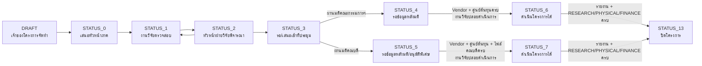
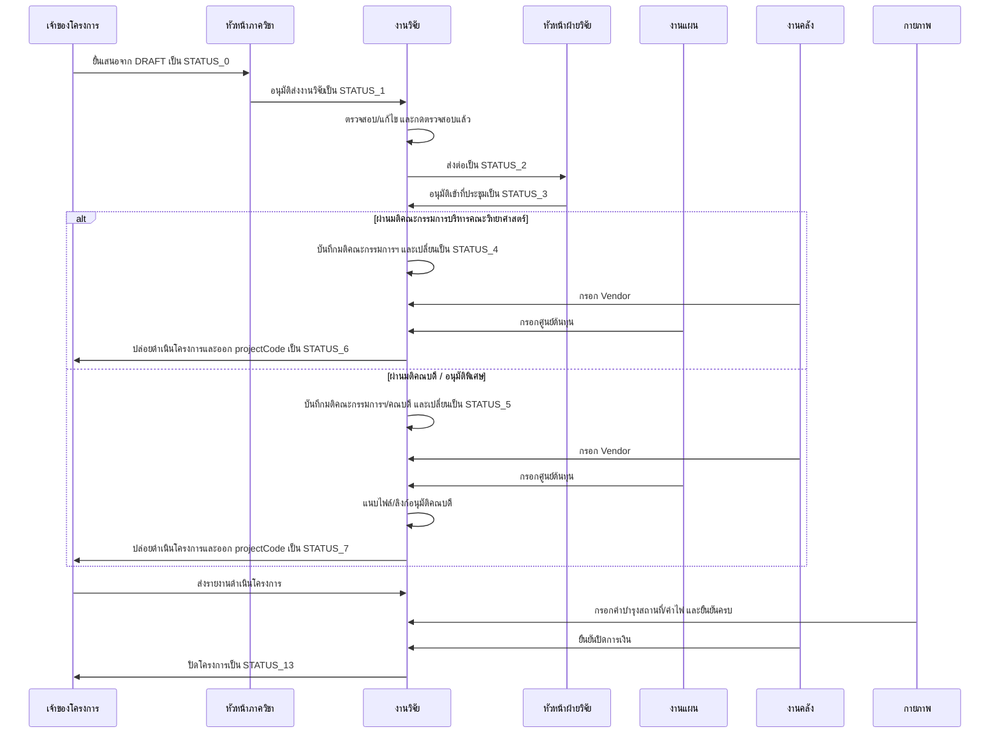
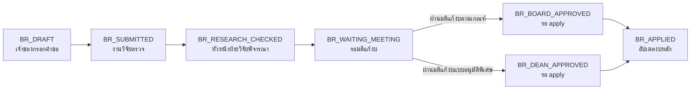

# Project Status Sequence Diagram

อ้างอิง state diagram และข้อสรุปจากการคุยล่าสุด: workflow หลักใช้ state `DRAFT, 0, 1, 2, 3, 4, 5, 6, 7, 13` โดย `8/9/10` ไม่ใช่เส้นทางหลักใหม่

## Overview

## Role Sequence

## Budget Revision Sub-flow

เมื่อ apply สายอนุมัติพิเศษ หาก project เดิมอยู่ `STATUS_6` ให้เปลี่ยนเป็น `STATUS_7`; หากเป็นสายตามเกณฑ์ ให้ project คง route เดิม
