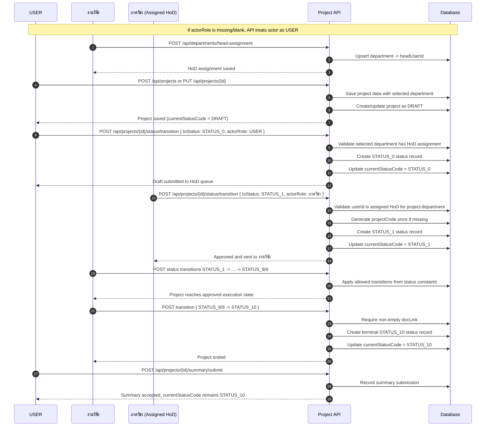
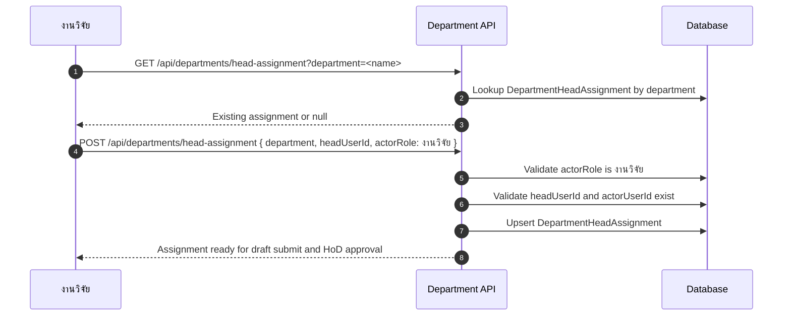
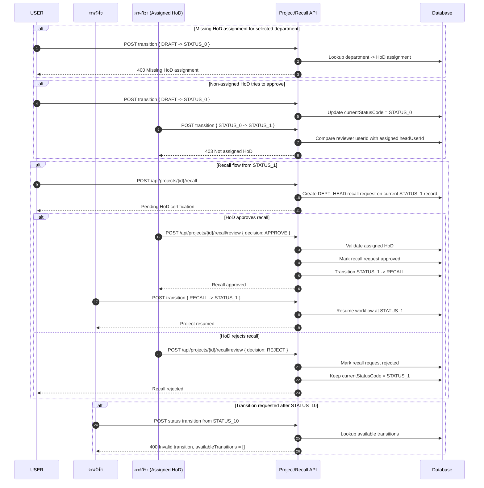
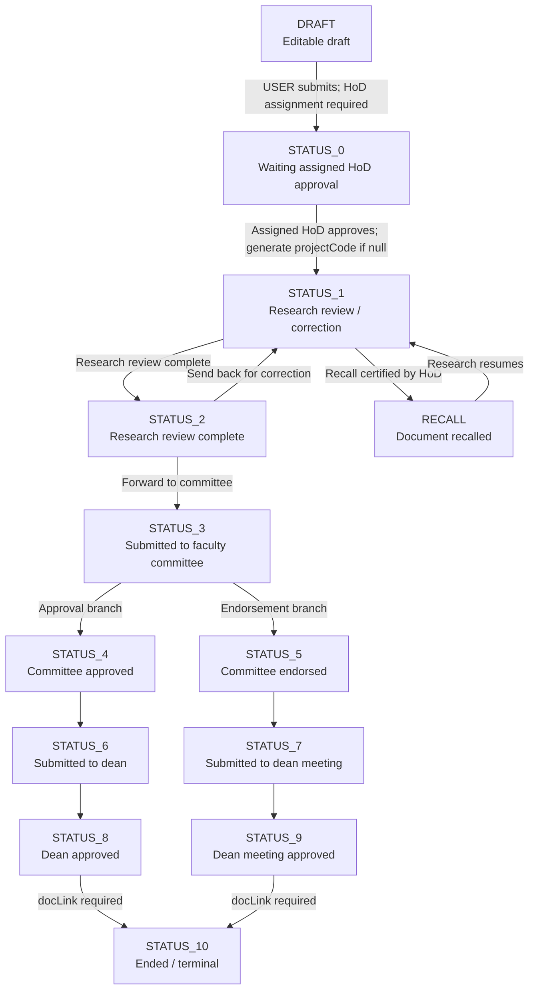

# Project Status Workflow Sequence Diagrams

Source alignment:

- `docs/usecase/status-workflow.md`
- `docs/usecase/recall-workflow.md`
- `prisma/schema.prisma`
- `app/api/projects/[id]/status/transition/route.ts`
- `lib/status-service.ts`
- `app/api/overviews/route.ts`

Canonical state path:

`DRAFT -> STATUS_0 -> STATUS_1 -> STATUS_2 -> ... -> STATUS_10`

`RECALL` is a side state from `STATUS_1`. `STATUS_10` is terminal.

## 1) Main Happy Path

## 2) HoD Assignment

## 3) Alternative Cases

## 4) Complete Active Project State Diagram

## 5) Implementation Alignment Notes

- Status changes should go through `POST /api/projects/{id}/status/transition`.
- `GET /api/overviews` displays current status labels but should not define canonical transition rules.
- Inline overview status editing is legacy behavior and should not be treated as the source of truth for the workflow.
- Formal `projectCode` generation belongs to HoD approval into `STATUS_1`.
- `STATUS_10` is final; new projects do not use `STATUS_11`, `STATUS_12`, `STATUS_13`, `STATUS_14`, or `STATUS_15`.
